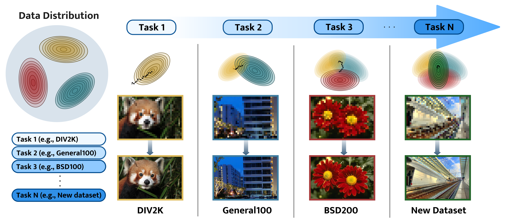
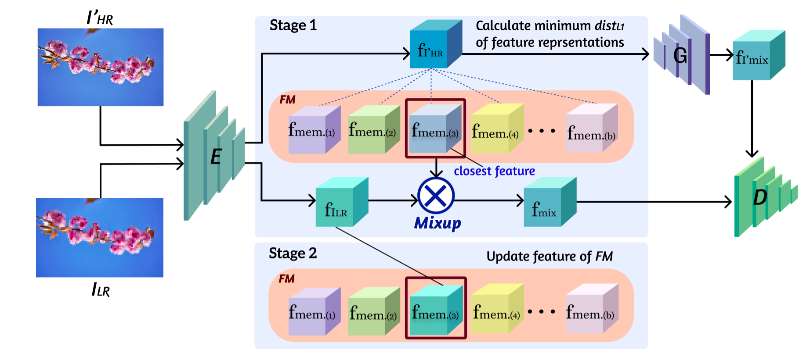

## RCRL_super_resolution
[RCRL: Replay-based Continual Representation Learning in Multi-task Super-Resolution](https://ieeexplore.ieee.org/document/9959552)

## Overview

## Run
For training and evaluation, the codes are consisted of jupyter type (.ipynb).
Please see the notations contained in codes in the 'main' folder.

